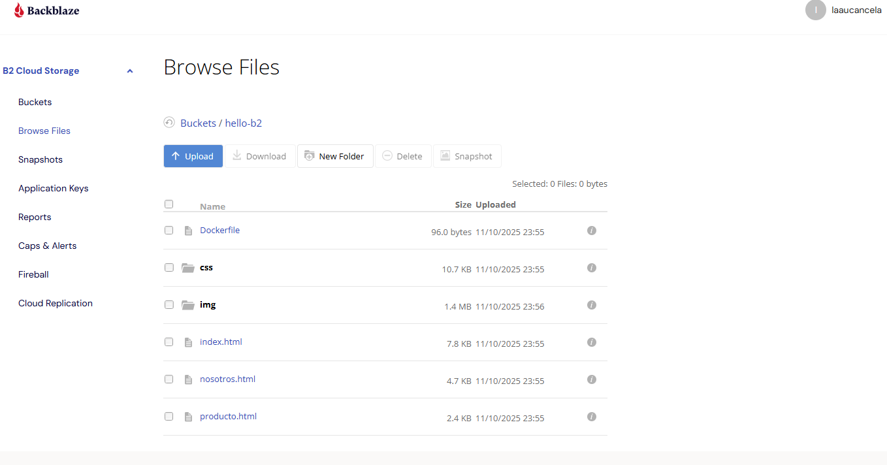
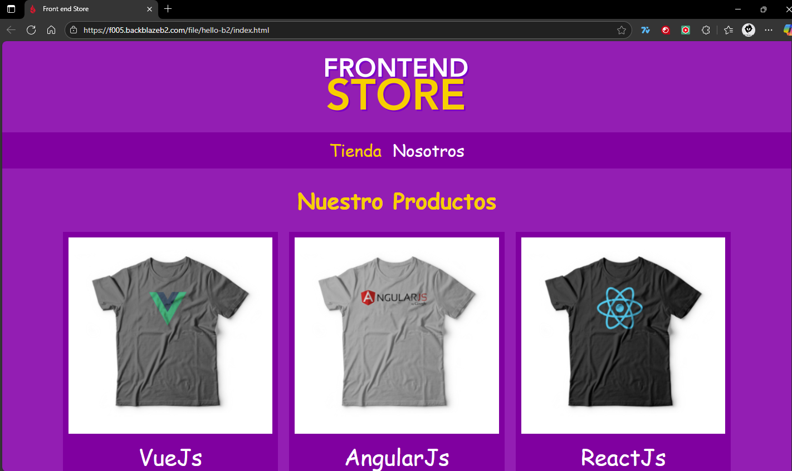
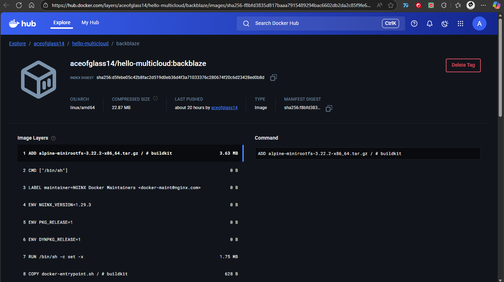

##  Description
Deployment of a static site on **Backblaze B2** as part of the *Distributed Programming - Cloud Hello World* project.  
The site is hosted in a **public bucket**, allowing access via a direct URL.

---

## 🌐 Project Information
- **Provider:** Backblaze B2 (object storage)
- **GitHub Repository:** [https://github.com/jatulcanaza/cloud-hello-world](https://github.com/jatulcanaza/cloud-hello-world)
- **Public URL:** [https://f005.backblazeb2.com/file/hello-b2/index.html](https://f005.backblazeb2.com/file/hello-b2/index.html)
- **DockerHub (evidence):** [aceofglass14/hello-multicloud:backblaze](https://hub.docker.com/layers/aceofglass14/hello-multicloud/backblaze/images/sha256-f8bfd3835d817baaa7915489294bac6602db2da2c85f9fe6e40e896a31afcac5)

---

##  Deployment Steps
1. Create a **public bucket** in Backblaze B2 (e.g., `hello-b2`).
2. Upload the site files, respecting the structure
3. Verify that the **MIME types** of the files are correct:
- `.css` → `text/css`
- `.jpg` / `.png` → `image/jpeg` or `image/png`
4. Access the site using the **public URL**:
https://f005.backblazeb2.com/file/hello-b2/index.html


---

##Docker Image (evidence)

```bash
docker build -t aceofglass14/hello-multicloud:backblaze .
docker push aceofglass14/hello-multicloud:backblaze
```

---

## Evidence

### Successful deployment on Netlify


### Site up and running


### Docker image uploaded


---

## Step-by-step tutorial for uploading images to Backblaze

### Step 1: Log in
1. Go to [https://secure.backblaze.com](https://secure.backblaze.com)
2. Log in with your account.
3. In the top menu → select Buckets.

---

### Step 2: Create or select a bucket
1. Click **‘Create a Bucket’** if you do not already have one.
2. Assign a name (for example, `hello-b2`).
3. Under ‘Bucket Type’, select **Public**.
4. Save your changes.

---

### Step 3: Create folders
1. Inside the bucket, click **‘Upload / Browse Files’**.
2. Create a folder `img/`.
3. Create a folder `css/` (if it does not exist).

---

### Step 4: Upload the images
1. Go to the `img/` folder.
2. Click on **Upload → Files**.
3. Select the images (`logo.png`, `1.jpg`, `2.jpg`, etc.).
4. Before confirming, look for the **Set Content Type manually** option (if it appears).
   - Enter `image/jpeg` or `image/png` as appropriate.
5. Click on Upload.

---
Step 5: Verify MIME type
After uploading, check:
1. In the file list → look for the Content Type column.
2. Confirm that each file has the correct type.
---
Step 6: Check display
Open in your browser:
https://f005.backblazeb2.com/file/hello-b2/index.html
---

