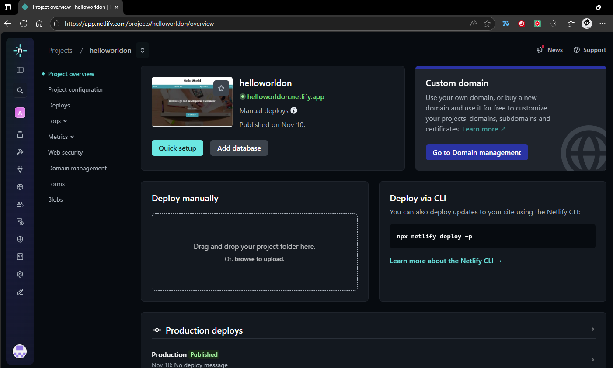
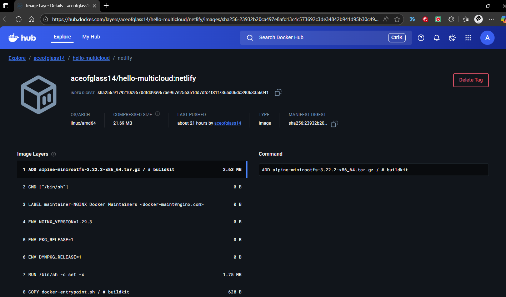

##Description
Deployment of a static website on **Netlify** as part of the *Distributed Programming - Cloud Hello World* project.  
The site was developed with **HTML and CSS**, deployed directly from GitHub, and includes DockerHub evidence for the project.

---

## Project Information
- **Provider:** Netlify (Static Site Hosting)
- **GitHub Repository:** [https://github.com/jatulcanaza/cloud-hello-world](https://github.com/jatulcanaza/cloud-hello-world)
- **Public URL:** `https://helloworldon.netlify.app`
- **DockerHub (evidence):** [aceofglass14/hello-multicloud:netlify](https://hub.docker.com/layers/aceofglass14/hello-multicloud/netlify/images/sha256-23932b20ca497e8afd13c4c573692c3de34842b941d95b30c49bd5af4c1313c0)

---

## Deployment Steps
1. Create a **new site** on [Netlify](https://app.netlify.com/).
2. Connect your **GitHub account** and select the repository branch `netlify`.
3. Configure the build settings:
   - **Build command:** *(leave empty)*
   - **Publish directory:** `netlify/`
4. Deploy the site and wait for the “✅ Deploy successful” message.
5. Copy the public URL generated by Netlify.

---

## 🐳 Docker Image (evidence)

```bash
docker build -t aceofglass14/hello-multicloud:netlify .
docker push aceofglass14/hello-multicloud:netlify
```
---
##Evidence


### Public with files


### Site deployed successfully


### Docker image on DockerHub



